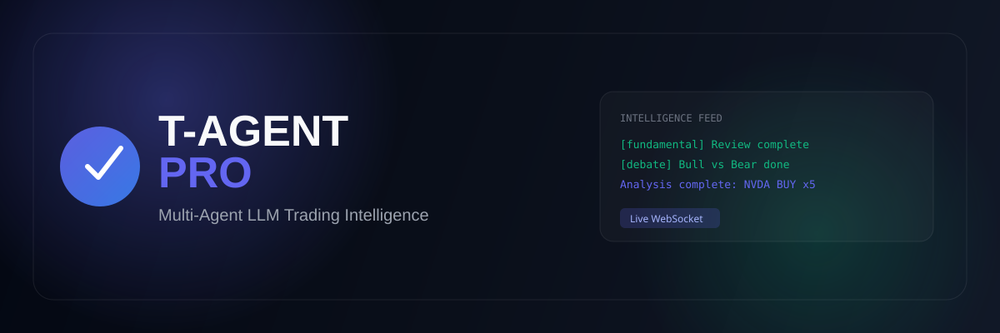
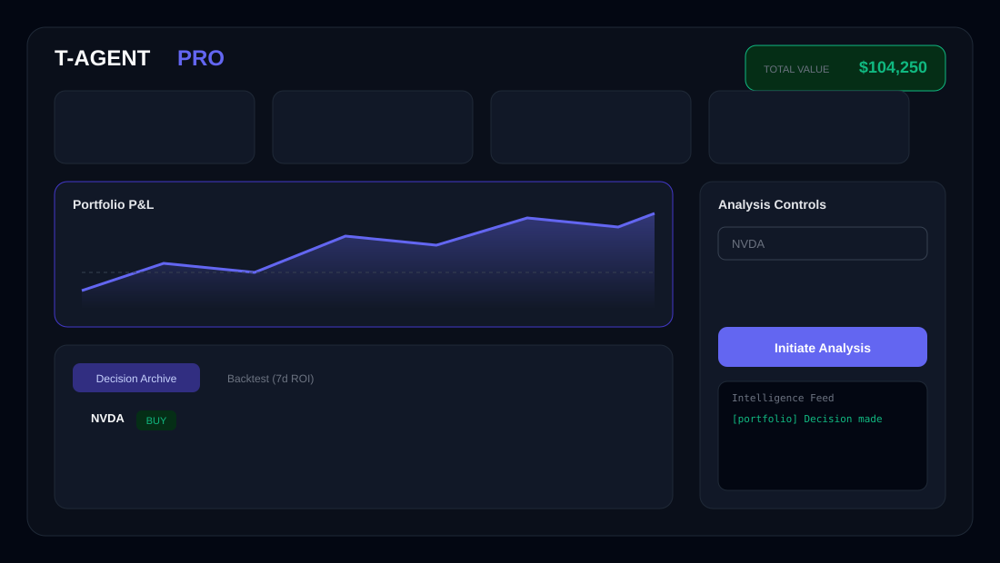
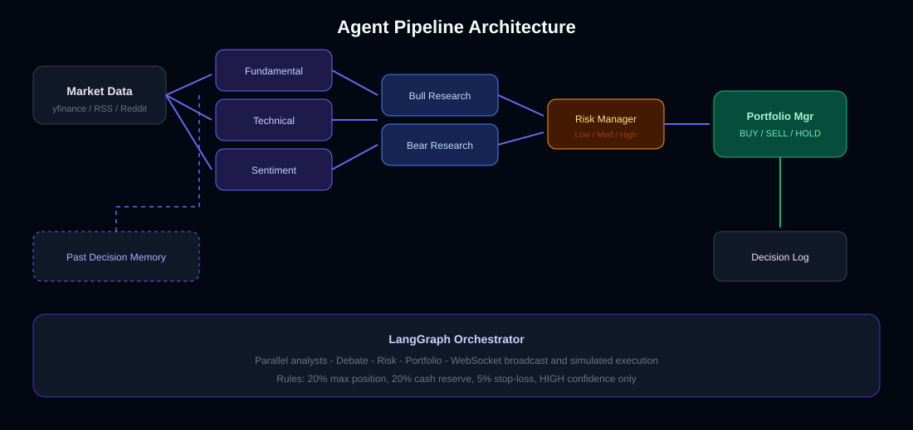

<p align="center">
  
</p>

<h1 align="center">T-AGENT PRO</h1>

<p align="center">
  <strong>Multi-Agent LLM Trading Intelligence Framework</strong><br/>
  Specialized AI analysts · Bull/Bear debate · Risk-managed portfolio decisions · Live dashboard
</p>

<p align="center">
  
  
  
  
  
  
</p>

<p align="center">
  
</p>

---

> **Disclaimer:** Built for research and education. Not financial advice. Simulated trades do not reflect real market execution.

## What is T-AGENT PRO?

T-AGENT PRO mirrors how a real trading desk works — but with LLM-powered agents. You pick a ticker, choose a risk profile and persona, and a **team of specialized agents** analyzes the market, debates the trade, passes through risk management, and outputs a portfolio decision with simulated execution.

<p align="center">
  
</p>

## Features

| | Feature | Description |
|---|---------|-------------|
| 🧠 | **Multi-Agent Pipeline** | Fundamental, technical & sentiment analysts run in parallel |
| ⚔️ | **Bull vs Bear Debate** | Researchers argue both sides before any decision |
| 🛡️ | **Risk Manager** | Blocks trades on extreme sentiment or high risk |
| 🎭 | **Trading Personas** | Buffett value, WSB degen, quant, or balanced manager |
| 📊 | **Live Dashboard** | WebSocket feed, P&L chart, decision archive, backtest tab |
| 💼 | **Portfolio Simulation** | Position limits, cash reserve, stop-loss, broker fees |
| 📈 | **7-Day Backtest** | ROI analysis on every logged BUY/SELL decision |
| 🖥️ | **CLI + API** | Terminal analysis or programmatic integration |

## Architecture

<p align="center">
  
</p>

See [docs/ARCHITECTURE.md](docs/ARCHITECTURE.md) for the full technical breakdown.

## Project Structure

```
MyTradingAgents/
│
├── 📄 main.py                  # CLI entry point
├── 📄 serve.py                 # API server entry point
├── 📄 pyproject.toml           # Package config & scripts
├── 📄 docker-compose.yml       # Container orchestration
│
├── 📁 apps/
│   └── web/                    # React + Vite dashboard (port 5173)
│       ├── src/App.jsx         # P&L chart, backtest tab, live feed
│       └── vite.config.js      # API/WebSocket proxy
│
├── 📁 src/                     # Python backend package
│   ├── agents/                 # LLM analyst & decision-maker chains
│   ├── graph/                  # LangGraph orchestrator
│   ├── data/                   # Market data fetchers & decision logger
│   ├── api.py                  # FastAPI routes + WebSocket
│   ├── cli.py                  # Rich terminal interface
│   ├── portfolio.py            # Simulated brokerage engine
│   ├── backtest.py             # 7-day ROI backtest engine
│   ├── config.py               # Environment & LLM provider config
│   └── state.py                # LangGraph state schema
│
├── 📁 docs/
│   ├── ARCHITECTURE.md         # Technical deep-dive
│   └── assets/                 # README diagrams (SVG)
│
├── 📁 storage/
│   └── logs/                   # Runtime data (portfolio, decisions)
│
├── 📁 scripts/
│   └── start.ps1               # Launch API + dashboard (Windows)
│
└── 📁 tests/
    ├── test_portfolio.py       # Portfolio rule unit tests
    └── test_backtest.py        # Backtest logic unit tests
```

## Quick Start

### Prerequisites

- **Python 3.11+**
- **Node.js 18+** (dashboard)
- **LLM API key** — [OpenAI](https://platform.openai.com), [Gemini](https://ai.google.dev), or local [Ollama](https://ollama.com)

### Install

```bash
git clone <your-repo>
cd MyTradingAgents

python -m venv venv
venv\Scripts\activate        # Windows
# source venv/bin/activate   # macOS / Linux

pip install -e .
cp .env.example .env         # add your API keys
```

### Run

**Option A — Start script (Windows)**

```powershell
.\scripts\start.ps1
```

**Option B — Manual**

```bash
# Terminal 1 — API
python serve.py

# Terminal 2 — Dashboard
cd apps/web && npm install && npm run dev
```

Open **[http://localhost:5173](http://localhost:5173)**

**CLI analysis**

```bash
python main.py --ticker NVDA --risk conservative --persona standard
```

**Backtest & tests**

```bash
tagent-backtest              # 7-day ROI on logged decisions
pip install -e ".[dev]" && pytest   # 18 unit tests
```

## Configuration

| Variable | Default | Description |
|----------|---------|-------------|
| `OPENAI_API_KEY` | — | OpenAI API key |
| `GEMINI_API_KEY` | — | Google Gemini API key |
| `DEFAULT_LLM_PROVIDER` | `openai` | `openai` · `gemini` · `ollama` |
| `DEFAULT_MODEL` | `gpt-4o-mini` | Cloud model name |
| `OLLAMA_BASE_URL` | `http://localhost:11434` | Local Ollama server |
| `OLLAMA_MODEL` | `qwen2.5` | Local model name |
| `INITIAL_CASH` | `100000` | Simulated starting capital |
| `LOG_DIR` | `storage/logs` | Portfolio & decision storage |
| `API_PORT` | `8000` | API server port |

## Personas

| Persona | Style |
|---------|-------|
| `standard` | Balanced portfolio manager |
| `Warren Buffett (Value)` | Fundamentals-only, ignores hype |
| `WSB Degen` | Momentum, memes, aggressive YOLO |
| `The Quant` | Data-driven, ignores sentiment |

## API Reference

| Method | Endpoint | Description |
|--------|----------|-------------|
| `GET` | `/api/health` | Server & LLM status |
| `GET` | `/api/portfolio` | Simulated portfolio |
| `GET` | `/api/portfolio/pnl-history` | P&L chart data |
| `GET` | `/api/history` | Decision archive |
| `GET` | `/api/backtest` | 7-day ROI backtest |
| `POST` | `/api/analyze/{ticker}` | Start analysis |
| `WS` | `/ws` | Live progress feed |

## Docker

```bash
docker compose up --build
```

## License

MIT — see [LICENSE](LICENSE).
